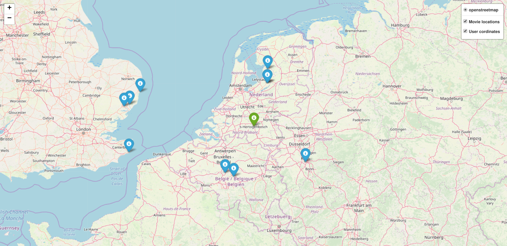

# -map_creation

Ця програма шукає 10 найближчих місць в яких знімались фільми, зняті в році, введеному користувачем, до координат, які вводить користувач.

### Передумови
Щоб програма коретно працювала потрібно становити деякі бібліотеки.
```
pip install pandas
```

```
pip install folium
```

```
pip install geopy
```


### Структура html файлу

``` <head> ``` - використовується для збереження інших елементів, ціль яких допомогти браузеру працювати з данними.

``` <body> ``` - використовується для зберігання змісту веб-сторінки.
``` <script> ``` - використовується для опису скриптів і може містити посилання на програму чи певний текст.


### Приклад запуску введення та скріншот згенерованої мапи
```
Please enter a year you would like to have a map for: 2000
Please enter your location (format: lat, long): 51.65342, 5.3221
Map is generating...
Please wait...
Finished. Please have look at the map Map.html
```



### Висновок
Ми можемо використовувати цю карту, щоб дізнатися інформація про місця де знімалися фільми, які були зняті в певному році.


### Автор
Лілія Івасютин


